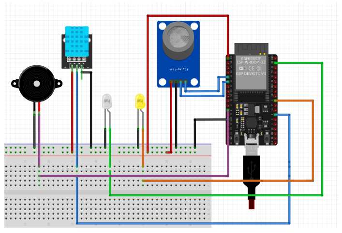

# 🏠 Domotia SmartHome — ESP32

Système de domotique basé sur **ESP32** avec interface web en temps réel. Permet de surveiller la température, l'humidité, le niveau de gaz, et de contrôler des LEDs et une alarme via un navigateur web.

---

## 📋 Fonctionnalités

- 🌡️ Lecture de **température et humidité** (capteur DHT11)
- 💨 Surveillance du **niveau de gaz** (MQ-2 ou similaire) avec historique
- 💡 Contrôle de **2 LEDs** à distance
- 🔔 Activation/désactivation d'une **alarme sonore**
- 🔐 **Authentification utilisateur** (inscription / connexion / suppression de compte)
- 🌐 Interface web servie depuis la mémoire flash (LittleFS)
- ⚡ Communication **WebSocket** temps réel (port 81)
- 📡 API REST (port 80)

---

## 🔧 Matériel requis

| Composant              | Quantité |
|------------------------|----------|
| ESP32 DevKit V4        | 1        |
| Capteur DHT11          | 1        |
| Capteur de gaz (MQ-2)  | 1        |
| LED (blanche ou autre) | 2        |
| Buzzer                 | 1        |
| Breadboard + fils      | —        |

---

## 📌 Brochage (Pinout)

| Composant             | Broche ESP32 |
|-----------------------|--------------|
| DHT11 (data)          | GPIO 4       |
| LED 1                 | GPIO 5       |
| LED 2                 | GPIO 6       |
| Buzzer (alarme)       | GPIO 7       |
| Capteur gaz (analogique) | GPIO 1    |
| Capteur gaz (numérique)  | GPIO 2    |

---

## 📁 Structure du projet

```
test_littlefs/
├── test_littlefs.ino   # Code principal Arduino (ESP32)
└── data/
    └── index.html      # Interface web (chargée dans LittleFS)
```

---

## ⚙️ Configuration

Avant de téléverser, modifiez les identifiants WiFi dans `test_littlefs.ino` :

```cpp
const char* ssid     = "VOTRE_SSID";
const char* password = "VOTRE_MOT_DE_PASSE";
```

> ⚠️ **Ne commitez jamais vos vrais identifiants WiFi sur GitHub.** Utilisez un fichier `secrets.h` ignoré par `.gitignore`.

---

## 📦 Bibliothèques requises (Arduino)

Installez via le **Gestionnaire de bibliothèques** Arduino IDE :

- `WiFi` (incluse ESP32)
- `WebServer` (incluse ESP32)
- `WebSocketsServer` — par *Markus Sattler*
- `LittleFS` (incluse ESP32)
- `DHT sensor library` — par *Adafruit*
- `ArduinoJson` — par *Benoit Blanchon*

---

## 🚀 Installation et flash

### 1. Installer l'IDE Arduino + support ESP32
Ajouter dans les URL supplémentaires de gestionnaire de cartes :
```
https://raw.githubusercontent.com/espressif/arduino-esp32/gh-pages/package_esp32_index.json
```

### 2. Flash du système de fichiers (LittleFS)
- Installez le plugin **ESP32 LittleFS Data Upload** pour Arduino IDE
- Placez `index.html` dans le dossier `data/`
- Menu : **Outils → ESP32 Sketch Data Upload**

### 3. Téléverser le sketch
- Sélectionnez la carte **ESP32 Dev Module**
- Cliquez sur **Téléverser**

### 4. Accéder à l'interface
- Ouvrez le Moniteur Série (115200 baud)
- Notez l'adresse IP affichée
- Ouvrez dans un navigateur : `http://<IP_ESP32>`

---

## 🌐 API REST

| Endpoint           | Méthode | Description                    |
|--------------------|---------|-------------------------------|
| `/`                | GET     | Interface web principale       |
| `/api/sensor`      | GET     | Données capteurs (JSON)        |
| `/api/gas-history` | GET     | Historique gaz (JSON)          |
| `/api/led?led=1`   | GET     | Toggle LED 1                   |
| `/api/led?led=2`   | GET     | Toggle LED 2                   |
| `/api/alarm`       | GET     | Toggle alarme                  |

---

## 🔌 WebSocket (port 81)

Connexion : `ws://<IP_ESP32>:81`

Messages JSON supportés :

```json
{ "action": "login",        "email": "...", "password": "..." }
{ "action": "register",     "name": "...", "email": "...", "password": "..." }
{ "action": "delete",       "email": "...", "password": "..." }
{ "action": "changePassword","email": "...", "currentPassword": "...", "newPassword": "..." }
{ "action": "toggle_led1" }
{ "action": "toggle_led2" }
{ "action": "toggle_alarm" }
```

---

## 🔒 Sécurité

- Les mots de passe sont stockés **en clair** dans `users.json` sur LittleFS — à améliorer avec un hash pour la production.
- Maximum **10 clients WebSocket** simultanés.
- Les actions de contrôle nécessitent une **authentification préalable**.

---

## 📷 Schéma du circuit



---

## 📄 Licence

MIT — libre d'utilisation, modification et distribution.
